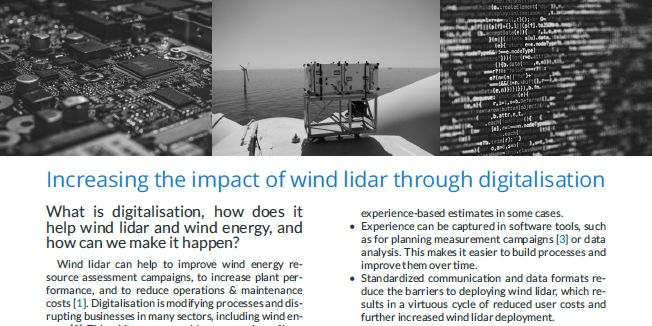

# Increasing the impact of wind lidar through digitalisation
This white paper provides an overview of how digitalisation could help the wind energy industry benefit from wind lidar, and what needs to be done to make this vision a reality.

To find out more about specific activities, see the Task 32 website at https://community.ieawind.org/task32/home.

This repository includes:
 - A PDF of the white paper: "main.pdf".
 - A banner image for use in the repository or elsewhere
 - All of the files required to produce the roadmap using the LaTeX document preparation system.

# Versions
Please note that this document will be updated regularly. Releases (i.e., stable versions) can be found at https://github.com/IEA-Wind-Task-32/white-paper-Task32-lidar-digitalisation/releases and at https://doi.org/10.5281/zenodo.3447756. 

# How to provide feedback
There are two ways to provide feedback to this document.

## Through Github
You can provide feedback by [raising an issue](https://github.com/IEA-Wind-Task-32/white-paper-Task32-lidar-digitalisation/issues). Before you raise an issue, please take a few minutes to check if there is a similar one in the list already.

**You will have to be logged in to Github to provide feedback**. This means that your feedback will be associated with your username, which may make it possible to identify you. We prefer to have feedback associated with a name because RP18 is a community document.

## Via the IEA Wind Task 32 Operating Agent
Please send your feedback to [ieawind.task32@ifb.uni-stuttgart.de](mailto:ieawind.task32@ifb.uni-stuttgart.de). Please note that your email may be forwarded in its entirety to the rest of the author team. If you need anonymity, please indicate this in your email. Your email should include:
- **Section** What section of RP18 does this feedback apply to?
- **Issue or challenge:** What is the problem, issue, or challenge?
- **Proposal:** What would you like to see instead?
- **More information:** Where can we get more information? Please provide e.g. a URL.
